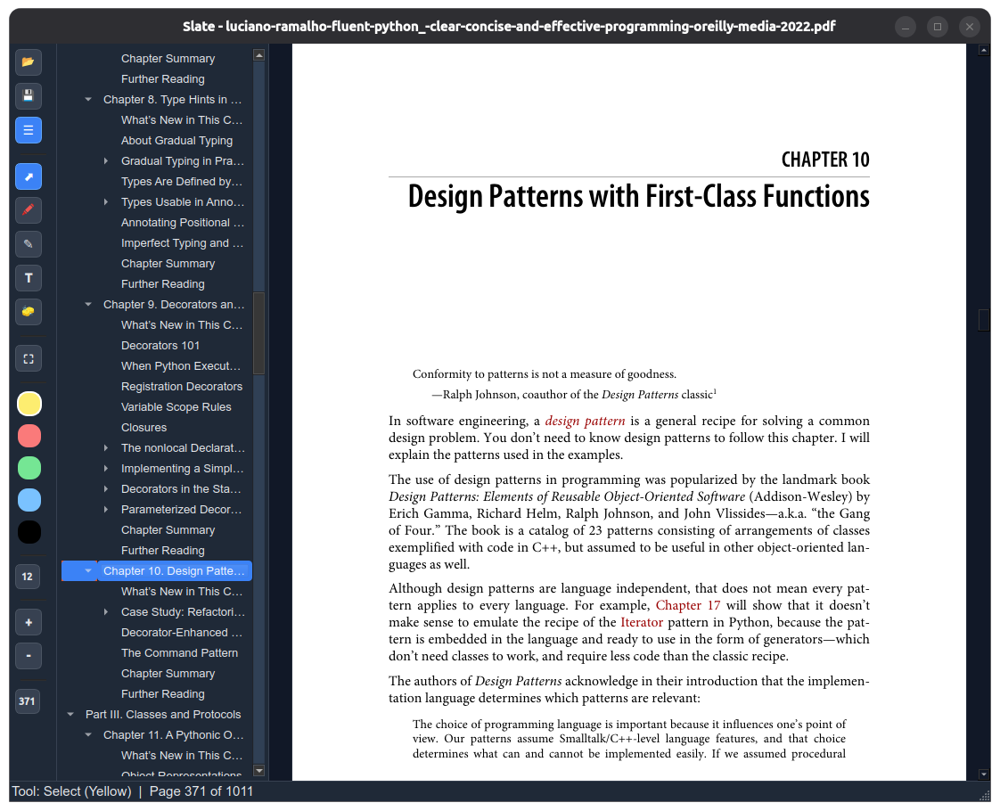
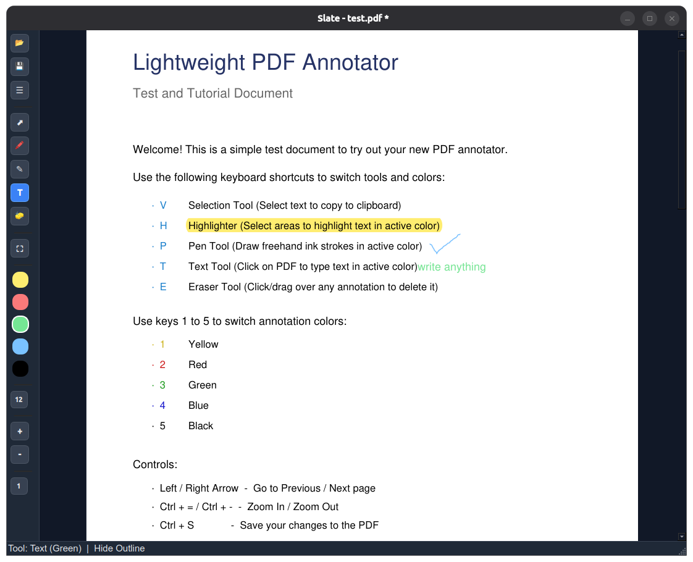

<p align="center">
  
</p>

<h1 align="center">Slate</h1>

<p align="center">
  <strong>A fast, keyboard-driven PDF reader & annotator.</strong>
</p>

<p align="center">
  
  
</p>

---

**Slate** is a lightweight desktop app built for reading PDFs and taking notes quickly. Instead of dealing with slow, bloated PDF suites, Slate focuses on speed, instant startup, and a completely keyboard-driven workflow.

---

## Why Slate?

* **Low Memory Usage:** Dynamically loads and unloads pages as you scroll, easily handling 1000+ page books without memory lag.
* **Keyboard-First:** Switch tools, change colors, zoom, and navigate pages using single-key shortcuts.
* **Tool-Specific State Memory:** Remembers the last color used for each tool (Pen, Highlight, Text, Shapes) separately during your session, so you don't have to keep toggling colors.
* **Custom Line Widths:** Adjustable stroke width spinner in the toolbar (sizes 1–20) that applies immediately to Pen drawing, Square outlines, and Arrowheads.

---

## Keyboard Shortcuts

| Key | Tool / Action | Description |
| :--- | :--- | :--- |
| **`V`** | **Select Text & Links** | Select blocks (`Ctrl + C` to copy) & click internal/web links. |
| **`H`** | **Highlight** | Highlight text in active color. |
| **`P`** | **Pen** | Draw/sketch freely. |
| **`T`** | **Text** | Click to type text. Click existing text to edit/drag. |
| **`S`** | **Square** | Draw a rectangle/square outline shape. |
| **`A`** | **Arrow** | Draw an arrow shape. |
| **`E`** | **Eraser** | Click/drag over any annotation to delete it. |
| **`Hold Ctrl`** | **Temporary Eraser** | Press and hold `Ctrl` to erase; release to return to active tool. |
| **`R`** | **Rect Selection** | Toggle rectangle-box selection mode on/off. |
| **`1` - `5`** | **Colors** | Yellow (`1`), Blue (`2`), Green (`3`), Red (`4`), Black (`5`). |
| **`Ctrl + F` / `/`** | **Search Document** | Open floating search bar. `Enter` (Next), `Shift + Enter` (Prev), `Esc` (Close). |
| **`O` / `0` / `F9`** | **Toggle Outline** | Toggle Outline sidebar. `Escape` or `0`/`o` to close & return focus. |
| **`j` / `k`** | **Vim Scroll** | Scroll vertical canvas down / up smoothly by small increments. |
| **`Shift + J` / `K`** | **Vim Page Scroll** | Jump directly to the next / previous page. |
| **`Left` / `Right`** | **Page Navigation** | Go to the previous / next page (alternative keys). |
| **`Ctrl + =` / `-`** | **Zoom** | Zoom In / Zoom Out. |
| **`Ctrl + S`** | **Save** | Save edits directly to the PDF file (garbage-collected fallback). |
| **`Ctrl + O`** | **Open** | Open a new PDF. |

---

## Installation

### Windows
1. Download **`slate-setup.exe`** from the [Releases](https://github.com/sharjeel103/slate/releases) tab.
2. Double-click the installer and complete the setup wizard.
3. Slate will install to your system and automatically associate with `.pdf` files, allowing you to double-click any PDF to open it in Slate.

### Ubuntu/Debian
1. Download **`slate_1.0.0_amd64.deb`** from the [Releases](https://github.com/sharjeel103/slate/releases) tab.
2. Install it via terminal:
   ```bash
   sudo apt install ./slate_1.0.0_amd64.deb
   ```
3. Run the app by typing `slate` in your terminal or launching it from your desktop applications menu.

---

## Developer Setup

To run from source:

```bash
# 1. Clone & enter dir
git clone https://github.com/sharjeel103/slate.git
cd slate

# 2. Setup environment & install packages
python3 -m venv venv
source venv/bin/activate
pip install -r requirements.txt

# 3. Run
python main.py
```
To rebuild the `.deb` package:

```bash
# Build default version 1.0
./build_deb.sh

# Or specify a custom version
./build_deb.sh 1.1
```
